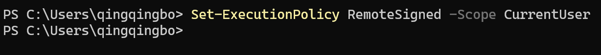
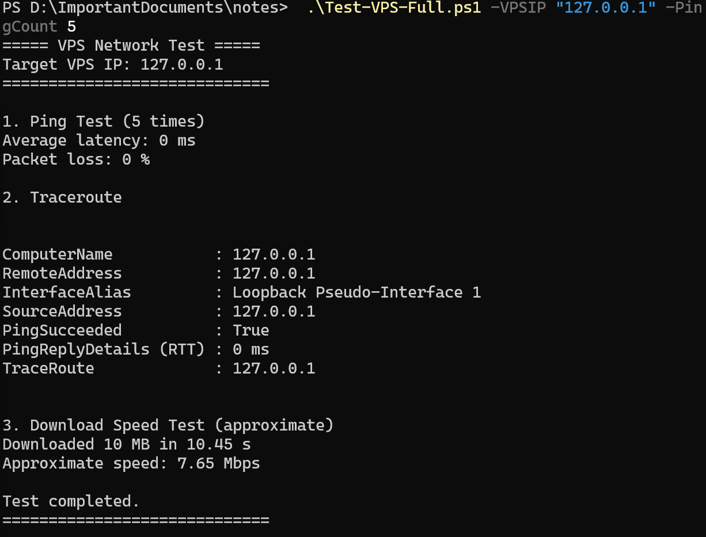

# Test-VPS-network-status


One-click test of the VPS average latency, packet loss rate, routing nodes, and bandwidth speed.

一键测试 VPS 网络状态，包括：
平均延迟（Average latency）、丢包率（Packet loss rate）、路由节点（Traceroute）、近似带宽速度（Approximate bandwidth speed）

---

## 目录

- [项目介绍](#test-vps-network-status)
- [一、使用方法](#一使用方法)
  - [1. 保存脚本](#1-保存脚本)
  - [2. 打开 PowerShell](#2-打开-powershell)
  - [3. 允许脚本执行](#3-允许脚本执行只需执行一次)
  - [4. 进入脚本所在目录](#4-进入脚本所在目录)
  - [5. 运行脚本](#5-运行脚本)
  - [6. 输出内容](#6-输出内容)
- [二、注意事项 / 常见问题](#二注意事项--常见问题)
  - [1. 不要在 CMD 中运行命令](#1-不要在-cmd-中运行命令)
  - [2. 脚本执行被阻止](#2-脚本执行被阻止)
  - [3. 脚本编码问题](#3-脚本编码问题)
  - [4. Traceroute 出现 0.0.0.0](#4-traceroute-出现-0000)
  - [5. 带宽测试为近似值](#5-带宽测试为近似值)
- [三、建议的网络质量标准](#三建议的网络质量标准)


# 一、使用方法

## 1. 保存脚本

使用 **记事本或其他编辑器**，将脚本保存为：

```
Test-VPS-Full.ps1
```

脚本位置

Script file:

[Test-VPS-Full.ps1](./Test-VPS-Full.ps1)

---

## 2. 打开 PowerShell

以 **管理员身份运行 PowerShell**。

---

## 3. 允许脚本执行（只需执行一次）

运行以下命令：

```
Set-ExecutionPolicy RemoteSigned -Scope CurrentUser
```

如图所示：



该命令允许执行本地创建的 PowerShell 脚本。

---

## 4. 进入脚本所在目录

根据你的实际路径修改，例如：

```
cd D:\ImportantDocuments\notes
```
如图所示：


---

## 5. 运行脚本

将 IP 地址替换为你需要测试的 VPS IP：

```
.\Test-VPS-Full.ps1 -VPSIP "127.0.0.1" -PingCount 5
```
如图所示：


参数说明：

```
-VPSIP      要测试的 VPS IP 地址
-PingCount  Ping 测试次数
```

---

## 6. 输出内容

脚本会输出以下信息：

* 平均延迟（毫秒）
* 丢包率（百分比）
* 网络路径（Traceroute）
* 近似下载速度（Mbps）

如图所示：


---
# 二、注意事项 / 常见问题

## 1. 不要在 CMD 中运行命令

PowerShell 命令在 **命令提示符（cmd）** 中无法使用。

请确保使用 **PowerShell** 运行脚本。

---

## 2. 脚本执行被阻止

如果出现类似错误：

```
running scripts is disabled on this system
```

请运行：

```
Set-ExecutionPolicy RemoteSigned -Scope CurrentUser
```

然后重新运行脚本。

---

## 3. 脚本编码问题

如果出现类似错误：

```
Unexpected token
Missing }
```

可能是脚本编码问题。

请确保脚本使用：

```
UTF-8 编码
```

同时避免复制包含乱码或特殊字符的代码。

---

## 4. Traceroute 出现 0.0.0.0

这是正常现象。

某些网络节点会屏蔽 ICMP 响应，因此显示为：

```
0.0.0.0
```

这不一定表示网络存在问题。

---

## 5. 带宽测试为近似值

脚本通过下载一个小文件并计算下载时间来估算带宽速度。

因此该测试结果为 **近似值**，不会像专业测速工具那样精确，但对于快速评估 VPS 网络质量已经足够。


# 三、建议的网络质量标准

一般来说，较好的 VPS 网络指标为：

| 指标   | 推荐范围     |
| ---- | -------- |
| 延迟   | <150 ms  |
| 丢包率  | <1%      |
| 下载速度 | >50 Mbps |

